# 安装运行1

生物链林数据中心版节点程序 - BCF已支持在Windows、Linux和Mac系统安装使用，用户可基于自身的配置选择合适的系统版本安装。如果未指定系统版本号，则表示可以在该系统任意版本上安装运行。

除特殊说明外，本章节仅介绍如何在Windows系统下安装使用BCF.exe，其他操作系统的安装和使用将不再赘述。

本操作手册适用于V 3.5.25版本的BCF.exe。

## 运行环境

- 支持Win10 64位以及Windows Server2008+操作系统

- 支持Linux 操作系统

- 支持Mac操作系统

## 安装运行步骤

## 安装应用

### Windows下安装&卸载

本章节将介绍如何在Windows操作系统下安装与卸载BCF.exe。

#### 下载安装包

下载方式待补充

#### 安装

1. 安装准备
   
   点击BCF安装包 ，进入下图所示安装准备界面：
   
    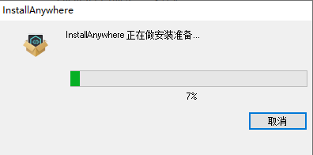

2. 语言选择
   
   待加载完成后，将自动跳转至如下图所示的语言选择界面，用户根据实际需要选择语言。当前支持“简体中文”和“English”两种语言，默认“简体中文”：
   
    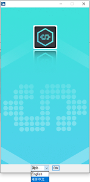

3. 选择安装集
   
   选择好语言并点击“OK”，进入BCF安装向导界面，如下图所示：
   
    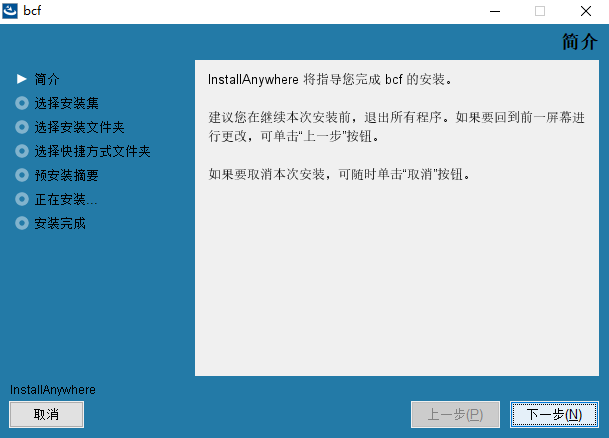
   
    点击“下一步”，按照界面提示选择合适的安装集，默认为“典型安装”：
   
    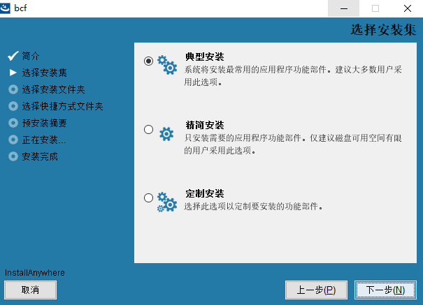

4. 选择安装目录
   
    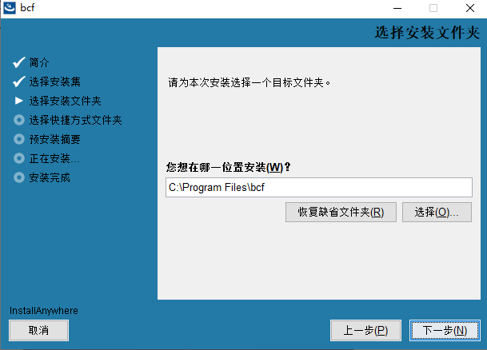

5. 选择快捷方式
   
   BCF提供多种创建快捷方式的选择：
   
   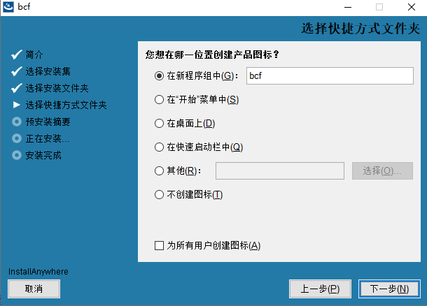
   
   1. 在新程序组中：选择该方式，则安装后会在“开始”菜单栏中新增一个文件夹，用于存放BCF.exe快捷图标，其中文件夹名称即为上图中用户命名的名称；
   
   2. 在“开始”菜单中：选择该方式，则安装后会直接在“开始”菜单栏中新增BCF.exe快捷图标，用户可以按照字母检索；
   
   3. 在桌面上：选择该方式，则安装后将直接在桌面上创建BCF.exe快捷图标；
   
   4. 在快速启动栏中：选择该方式，则安装后BCF.exe快捷图标将被置于快速启动栏；
   
   5. 其他：用户可以选择在指定位置创建BCF.exe快捷图标；
   
   6. 不创建图标：不对BCF.exe设置快捷图标，用户如需使用则需要到安装目录下打开。

6. 安装信息预览
   
   在正式安装前，界面会展示用户设置的安装信息，点击“上一步”，可以对已配置的信息进行修改；
   
    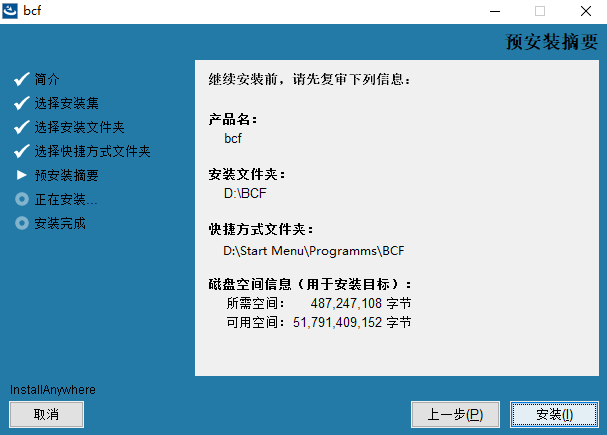

7. 安装
   
   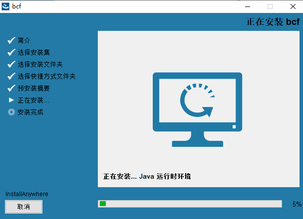
   
   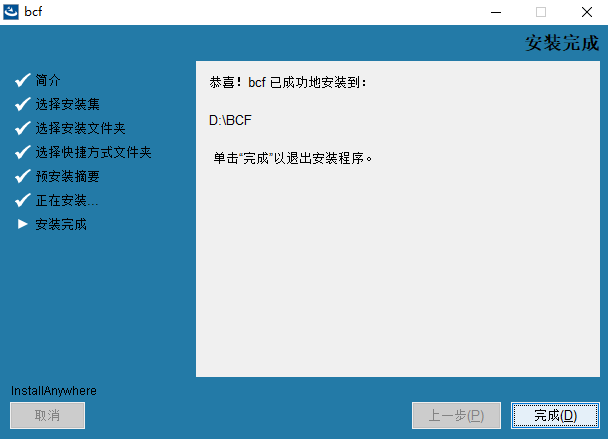

8. 安装成功
   
   安装好后将在预设置的快捷方式中显示BCF.exe的快捷启动图标：
   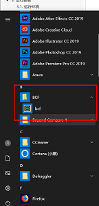

#### 卸载

用户可以通过如下两种路径卸载生物链林数据中心版节点程序(BCF.exe)：

1. 打开控制面板`Control Panel`-\>打开程序`Programs`-\> 打开程序和功能`Programs and Features`，选中应用程序`bcf`，点击“卸载/更改”进行卸载，如下图所示：
   
    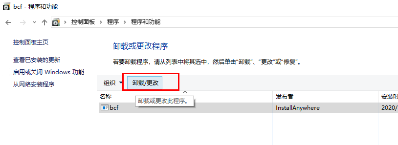
   
   点击“卸载”之后，出现如下图所示信息，点击窗口中的“下一步”，按照步骤进行卸载操作：
   
    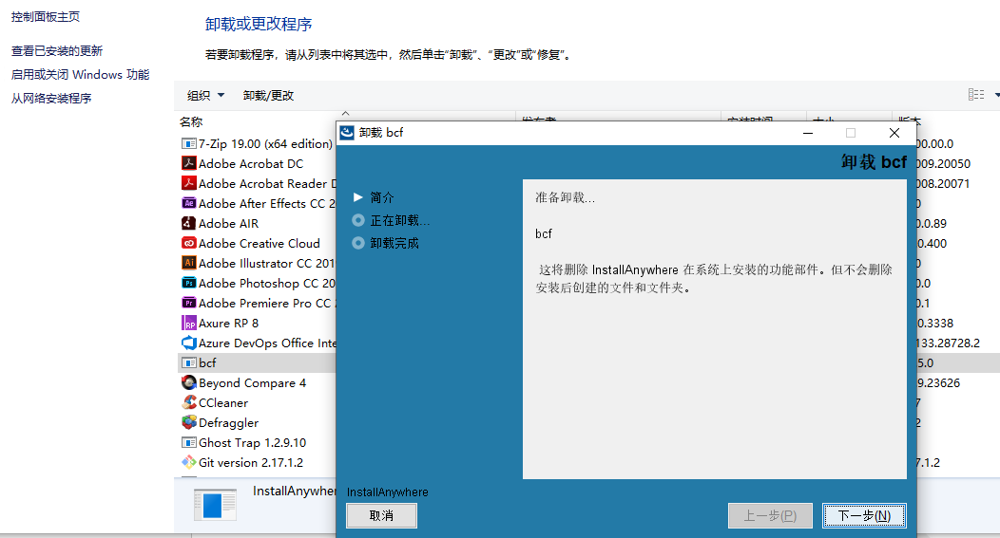

2. 点击开始`Start`菜单，找到BCF.exe的快捷图标，鼠标右击，在弹出的窗口中，选择“卸载”并按照操作提示进行卸载，如下图所示：
   
    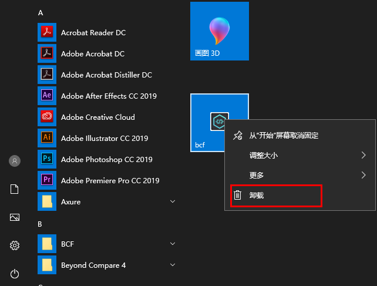
   
   > 注：以上任一路径卸载成功之后，桌面和菜单按钮都将找不到BCF.exe图标。当前卸载会保留当前链的数据文件和日志文件，如果想完全清除文件，则需要到安装目录下删除所有文件以及子文件。

## 申请授权

用户按照上一章节描述的步骤成功安装好应用程序BCF.exe后，打开应用时，应用会展示如下图所示的未授权提示界面（此后，如用户一直未获得授权文件，则在每次打开BCF时，都将出现该未授权的错误提示）：

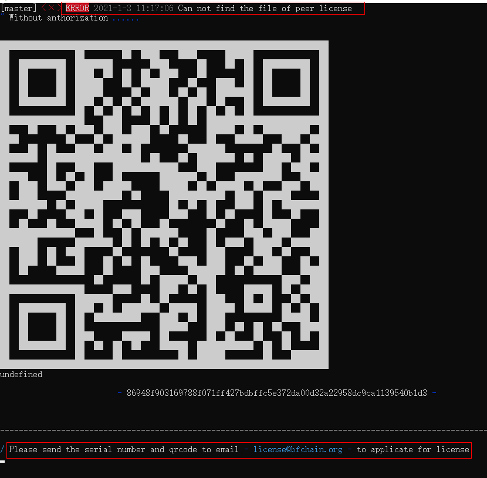

在上述情况下，用户需要先完成节点/区块链授权申请。

BCF授权一般分为节点授权和区块链授权。

- 节点授权：指针对每台设备进行授权，只有经过节点授权的设备才可以运行BCF.exe，否则无法运行。每台设备分别对应一个节点授权文件，同样的节点软件，安装到另外的设备则无法运行，除非这台设备也具有特定的授权文件。

- 区块链授权：指当运行非生物链林主链BFChain时需要授权，如果用户想要运行自己的创世块的链，则需要向生物链林BCF团队申请。如果没有获得区块链授权文件，则只能运行生物链林主链BFChain。

### 节点授权申请

请按照如下步骤完成节点授权申请：

1. 打开应用程序BCF.exe；

2. 获得要申请授权的节点序列号：
   
   通过手机直接扫描下图中的二维码，或者直接拷贝二维码下方的序列号，均可以获得节点的授权序列号。如下图的节点序列号为：
   
   86948f903169788f071ff427bdbffc5e372da00d32a22958dc9ca1139540b1d3
   
    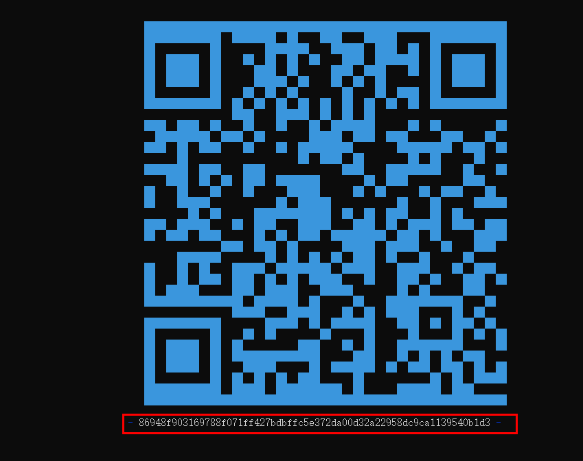

3. 发送申请节点的授权序列号至邮箱<license@bfchain.org>：
   
    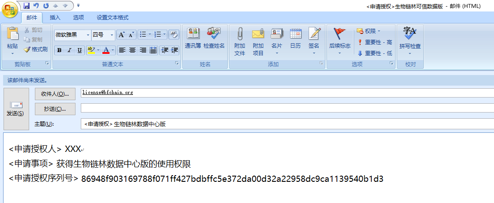
   
   可按照上图邮箱的内容格式发送节点授权申请至邮箱<license@bfchain.org>，申请生物链林数据中心版节点程序BCF.exe的使用权限。

4. 获得授权码文件
   
   耐心等待1\~3工作日之后，您将收到申请授权成功的邮件(如下图所示)：
   
    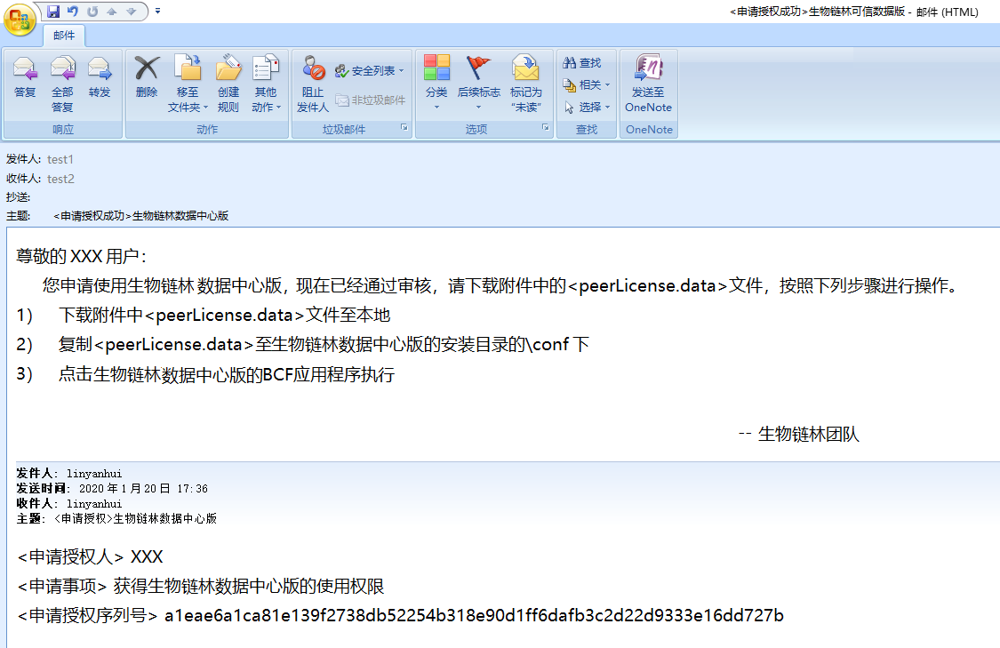
   
   请按照邮件给出的操作步骤，复制邮件附件提供的`peerLicense.data`授权文件至BCF安装目录下的`/conf`文件夹下，即可完成节点授权。
   
    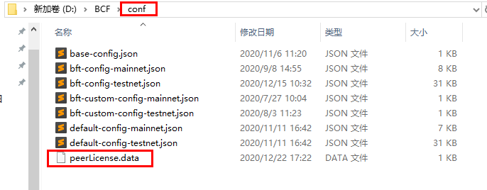

### 区块链授权申请

#### 申请创建创世块

待确认

#### 申请区块链授权

用户如果想要运行自己创世块的链，则需要以邮件的形式向生物链林BCF团队申请区块链授权，邮件中必须包含如下信息：

1. 申请授权人：填写授权人的名字；

2. 授权事项：描述此邮件需要授权的事项；

3. 创世块信息：创世块申请成功后，生物链林团队会提供包含该创世块信息的json文件，请将此信息以附件形式添加进邮件里；

4. 申请授权的节点序列号：如何获取节点序列号信息，请参见\<[节点授权申请](#_节点授权申请_1)\>；

5. 申请授权的用途：请描述清楚该节点的授权用途，如开发、测试、生产等。

邮件内容的输入格式，请参考上文\<[节点授权申请](#_节点授权申请_1)\>。

当收到申请成功的邮件回复后(一般1-3个工作日)，请将附件中的`license.json`文件复制至BCF.exe安装目录下的`/genesisInfos`文件夹下，即可完成区块链授权。

> 注：包含创世块信息的json文件的文件名格式为：`x-genesisBlock-y.json`，`x`指主权益名，`y`指测试网络或正式网络。如下图所示的`msc-genesisBlock-testnet.json`表示主权益名为`msc`的测试网络的创世块。如您申请的创世块没有此文件，请联系生物链林BCF团队。

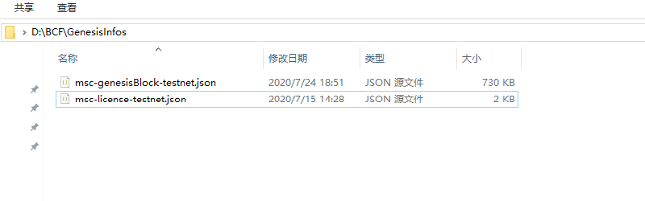

## 修改配置

### 配置文件说明

安装成功之后，可在安装目录下的`/conf`文件夹下找到BCF的配置文件，下表以`bft-config-testnet.json`文件为例，对文件中包含的各字段说明如下：

| **参数名**                         | **参数说明**                                                                            |
| ------------------------------- | ----------------------------------------------------------------------------------- |
| chainPort                       | 节点可能会使用到的端口号，需要注意避开已占用的端口。一般来说推荐使用区块链端口后的10位端口号进行配置，这里的bfchain测试网络区块链端口号为19000      |
| \- turnserver                   | 打洞服务器端口，默认为19001，需要注意的是打洞服务器会使用配置的端口以及配置端口+1的端口，也就是会占用19002                         |
| \- system_websocket_port        | Websocket接口占用的端口号，默认19003                                                           |
| \- clusterLock                  | 进程锁需要使用的端口，为节点内部使用。默认为19004                                                         |
| \- grpc                         | Grpc接口占用的端口号。默认为19005                                                               |
| \- update_service_port          | 更新程序访问端口：区块链底层系统提供版本自动升级功能时占用的端口号                                                   |
| \- service_port                 | 服务市场访问端口：访问节点服务市场时占用的端口号                                                            |
| \- mongodb                      | Mongodb使用的端口号，默认为19010                                                              |
| transactionConfig               | 关于事件的相关配置                                                                           |
| \- receiveVoteEnable            | 是否接收投票                                                                              |
| \- minFeePerByte                | 最小固定手续费，(发生)事件所需要的最小费用 = minFeePerByte\*事件字节长度                                      |
| &emsp;- numerator               | 数字，默认为1，分子                                                                          |
| &emsp;- denominator             | 数字，默认为153，分母                                                                        |
| \- maxFee                       | 自动投票事件的最大手续费，单位: 本                                                                  |
| \- maxTransactionLimitForVote   | 每轮可处理的最大投票交易数                                                                       |
| \- transactionsLimitPerBlock    | 区块事件阈值                                                                              |
| \- autoVote                     | 自动投票相关配置                                                                            |
| &emsp;- enable                  | 是否开启自动投票                                                                            |
| &emsp;- useConfigFee            | 是否使用配置手续费                                                                           |
| &emsp;- fee                     | 手续费                                                                                 |
| &emsp;- priorRecommendedNumber  | 是否优先保证推荐人个数                                                                         |
| &emsp;- maxNumberOfRecommended  | 选出的推荐人数量上限                                                                          |
| &emsp;- numberOfRounds          | 选取的区块范围, 最近的 100 轮                                                                  |
| &emsp;- productivityPercent     | 在线率占比                                                                               |
| &emsp;- forgedBlocksPercent     | 打块数量占比                                                                              |
| &emsp;- applyTxPercent          | 打包交易数量占比                                                                            |
| &emsp;- votePercent             | 上一轮的得票率占比                                                                           |
| &emsp;- newDelegatePercent      | 新受托人占比                                                                              |
| &emsp;- minBeSelectProductivity | 最小可被推荐得账户在线率                                                                        |
| coreForProcess                  | 启动的进程数量                                                                             |
| \- forceUseConfig               | 是否使用该配置下的进程数量，默认为true，若为false，则节点自动根据CPU数采取最佳方案                                     |
| \- coreNumForDealTransaction    | 处理事件进程的数量，默认为1，建议与CPU核数相同，将能够提升tps性能                                                |
| \- coreNumForMemInfo            | 处理账务的进程数量，默认为1，建议为CPU核数/5，向上取整                                                      |
| \- coreNumForUntreatedTrs       | 存放未处理事件的进程数量，默认为1，建议为CPU核数/5，向上取整                                                   |
| logConfig                       | 关于日志文件的配置                                                                           |
| \- consoleLogLevel              | 控制台日志等级，提供三种模式： info：信息模式，提供节点状态和错误日志 warn：警告模式，提供警告和错误日志 error：错误模式仅输出错误日志 默认为info |
| \- fileLogLevel                 | 文件日志等级，提供三种模式，info、warn、error，默认为error，仅输出错误日志                                      |
| \- fileLogLimit                 | 单个日志文件的大小限制，单位：字节，默认为1000000000                                                     |
| \- fileLogBackup                | 备份日志的数量，默认为5。当单个日志文件超过限制，则会将该日志备份生成新的日志文件，这个日志文件将保留5份                               |
| \- fileLogDateExpire            | 是否使用日志过期时间，超过过期时间将清除日志，默认为false                                                     |
| \- fileLogDaysToKeep            | 日志保留的天数，当“fileLogDateExpire”设置为true时，将清除超过该天数的日志，默认为30天                             |
| networkConfig                   | 网络相关配置                                                                              |
| \- grpcEnable                   | 是否开启Grpc，默认开启                                                                       |
| forging                         | 锻造区块相关配置                                                                            |
| \- secret                       | 这里可以直接配置锻造者的私钥，通过配置文件注入，但一般不推荐这么做，因为在这里显示的私钥是明文的                                    |
| startConfig                     | 启动相关配置                                                                              |
| \- useCheckPoint                | 是否使用关键检查点启动，默认为true。将从backup文件中获取关键检查的信息，若有符合的关键点则会从关键启动，没有则会重建区块链                  |
| \- numberOfReservedCheckPoint   | 关键检查点数量                                                                             |
| \- peers                        | 节点配置：初始连接节点 ip                                                                      |
| \- maxChannelNumber             | 允许主动连接到当前节点的其他节点最大数量                                                                |
| \- generateBlockEnable          | 是否开启锻造区块，true 表示开始锻造区块，false 表示停止锻造区块                                               |
| \- remark                       | 区块备注                                                                                |
| reqCheckWhiteList               | 请求限制的白名单，在白名单内的ip可不受流量限制访问                                                          |
| mongoDb                         | Mongodb相关配置                                                                         |
| \- externalConnection           | 是否启用外部连接，默认为false，设置为true则可通过局域网连接到mongo                                            |
| \- user                         | 用户名及密码                                                                              |
| &emsp;- user                    | 用户名                                                                                 |
| &emsp;- pwd                     | 密码                                                                                  |
| \- limitPerQuery                | 分页查询的限制，默认为10000                                                                    |
| \- cmdLimitPerQuery             | 命令行分页查询的限制，默认为20                                                                    |
| \- limitPerInsert               | 插入数据的限制，默认为10000                                                                    |
| \- dbPath                       | Mongodb存放区块链数据的路径                                                                   |
| \- logPath                      | Mongodb的日志存放路径                                                                      |
| flowControlConfig               | 流控配置                                                                                |
| \- requestLimit                 | 请求限制的配置                                                                             |
| &emsp;- enable                  | 是否开启此限制                                                                             |
| &emsp;- count                   | 限制的次数                                                                               |
| &emsp;- apiRequestInterface     | API接口请求次数                                                                           |
| &emsp;- time                    | 限制的时间周期                                                                             |
| \- flowRequestLimit             | 以流量请求作为限制                                                                           |
| &emsp;- enable                  | 是否开启流量限制                                                                            |
| &emsp;- count                   | 流量请求量限制，单位：字节                                                                       |
| &emsp;- time                    | 限制的时间周期                                                                             |
| apiRequestBlackIp               | 是否开启将访问不存在api的ip加入黑名单的相关配置                                                          |
| - apiRequestBlackIp             | 是否开启将访问不存在api的ip加入黑名单，默认为false                                                      |
| \- noticeConfig                 | 满足下列任何一种配置的情况时（例如CPU使用率\>=90%），在某个时间sendIntervalTime(S)内只向邮箱发送一次警告信息                |
| &emsp;- enable                  | 是否开启向邮箱发送警告信息                                                                       |
| &emsp;- sendCondition           | 发送邮箱条件                                                                              |
| &emsp;&emsp;- usageCPU          | CPU使用率，默认为0.9                                                                       |
| &emsp;&emsp;- usageDisk         | 磁盘使用率，默认为0.9                                                                        |
| &emsp;&emsp;- usageMemory       | 内存使用率，默认为0.9                                                                        |
| &emsp;&emsp;- missedBlocks      | 掉块数量，默认为5                                                                           |
| &emsp;&emsp;- sendIntervalTime  | 发送间隔时间，默认为600000毫秒                                                                  |
| miningMachineVersionName        | 节点的版本名称                                                                             |
| \- miningMachineVersionName     | 描述节点的版本名称                                                                           |
| interceptIllegalRequestEnable   | 拦截非法请求，默认开启                                                                         |
| serverMarketEnable              | 是否开启服务市场                                                                            |
| diskMonitorConfig               | 磁盘监控相关配置                                                                            |
| - enable                        | 是否开启磁盘监控，默认开启                                                                       |
| \- clearPath                    | 监控磁盘路径                                                                              |
| \- clearWithSuffix              | 清理文件后缀名                                                                             |
| \- noClearWithSuffix            | 不清理文件后缀名                                                                            |
| \- checkInterval                | 检查时间间隔，单位：小时                                                                        |

### 配置数据库的用户名和密码

用户通过[\<申请授权\>](#_申请授权)授权成功之后，再次启动BCF.exe时，需要配置数据库的用户名和密码。

\<用户名\>`example`

\<密码\>`example`

请按照命令行提示，完成数据库用户名和密码的设置。
    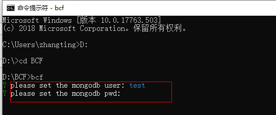

> 注：密码只能由字母、数字和下划线组成。

### 配置运行密码

#### 运行密码配置

为了保证用户执行命令行工具的安全，可以设置运行密码，在每个命令执行时输入密码，用来校验用户身份。

下文将简要介绍两种配置运行密码的方式，其中第2种方式不会在命令行中留下记录，较为安全，推荐第2种方式。

1. 在命令行中直接设置密码
   
   当用户按照[\<配置数据库的用户名和密码\>](#_修改配置文件)章节的描述完成数据库密码设置后，在正式启动前(指通过双击应用程序BCF.exe的图标启动)，可以在命令行窗口中为PASSWORD 变量加入密钥，设置命令行访问所需密码。具体步骤如下：
   
   1. 新开一个Windows的命令行窗口；
   
   2. 在命令行窗口中输入命令`set PASSWORD=123`，回车；
       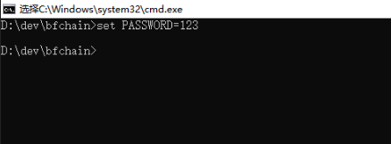
   
   设置成功后，当用户在BCF.exe中执行任何命令时将都需要使用该密码才能够进行。

2. 在批处理文件中设置密码
   
   1. 创建一个`.bat`的密码设置文件
      
      将下框内容复制到`. bat`文件中(密码修改为自己的密码)并保存文件：
       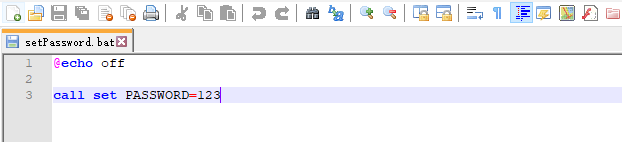
   
   2. 执行`bat`批处理文件
      
      在`cmd`中执行该`.bat`文件，完成运行密码设置。
       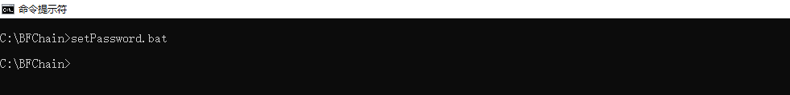
      
      > 注：必须在BCF程序正式启动前(指通过双击应用程序BCF.exe的图标启动)设置，启动后设置密码将无效。

#### 其他情况说明

1. 用户未设置密码
   
   如果用户没有设置密码，则在命令行窗口中直接执行查询当前最新区块信息的命令（Windows命令为`bcf /glb`；Linux命令为`bcf –glb`，下文中除特殊说明外，默认都将以Windows命令为例；如果您当前的环境为Linux，则只需将Windows命令中的`/`，用`–`替换即可），亦可获取最新区块：
   
    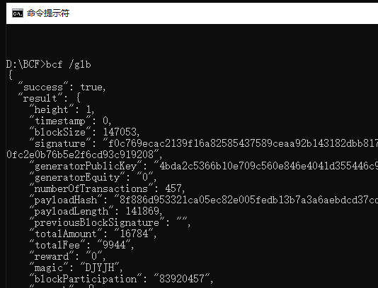

2. 用户已设置密码
   
   如果用户有设置密码，直接使用命令`bcf /glb`会出错，如下图所示：
   
    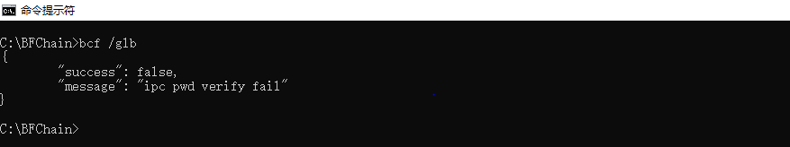
   
    如果想正确调用，则需要在每个命令行后加入密码` /sp 123`。
   
    正确调用方法是输入命令`bcf /glb /sp 123`来获取最新区块。如下图所示：
    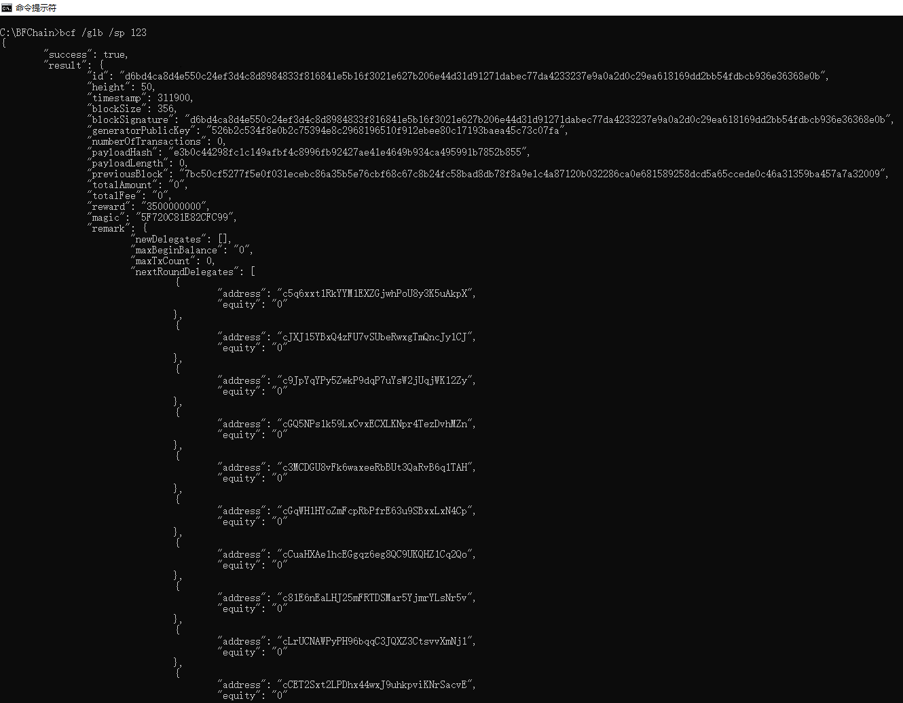

3. 用户忘记密码
   
   如果用户忘记密码，则无法使用命令行命令访问接口。在这种情况下，用户只能先关闭程序，在重新启动时重设密码。

### 配置网络环境

当前，BCF提供了测试网络和正式网络的环境供用户使用。用户可以根据实际需要，自由切换BCF的运行环境。本节主要是说明如何配置BCF运行的网络环境，此为<mark>可选配置</mark>，若用户想在测试环境下运行BCF.exe，则可以跳过此步骤。

BCF默认使用测试网络环境。

按照下列步骤，用户可以实现正式网络和测试网络的切换：

1. 修改配置文件，配置文件路径：`/安装目录/conf/base-config.json`：
   
   1. 设置`bnid`（区块链网络类型标识符）参数：
      
      1. 若您想在测试网络环境下运行，则设置`bnid`为`c`
      
      2. 若您想在测试网络环境下运行，则设置`bnid`为`b`
      
      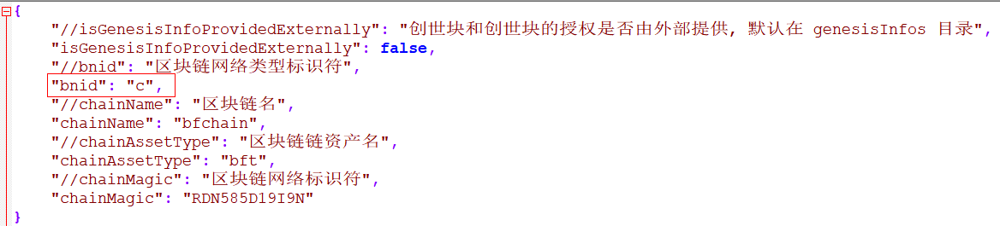

> 注：在后续使用过程中，如果用户需要切换节点网络状态，最好先关闭BCF.exe，待配置好后重新启动BCF.exe；否则，在BCF运行的过程中，如果修改配置文件，当前虽能保存成功，但配置不会生效。只有在重新启动后修改的配置才能生效。

### 配置节点运行的链

若用户还申请了自己的创世块，BCF也支持在不同链之间的切换。用户可以根据实际需要，自由切换当前BCF节点运行的链。本节主要是说明如何配置BCF运行的链，此为`可选配置`，若用户想运行在BFChain链下，则可以跳过此步骤。

BCF默认使用BFChain链。

按照下列步骤，用户可以实现不同链的切换：

1. 修改配置文件，配置文件路径：`/安装目录/conf/base-config.json`：
   
   1. 设置`isGenesisBlockProvidedExternally`参数：
      
      1. 若您想运行自己的链，则设置`isGenesisBlockProvidedExternally`为`true`；同时，还需修改如下参数值` chainName`、` assetType`和` chainMagic`；
      
      2. 若您想运行BFChain主链，则设置`isGenesisBlockProvidedExternally`为`false`
      
      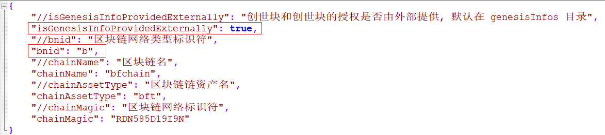

各参数说明如下：

| **参数名称**                           | **参数说明**      | **参数内容说明**                                    |
| ---------------------------------- | ------------- | --------------------------------------------- |
| `isGenesisBlockProvidedExternally` | 是否使用自己的创世块启动  | `true`：表示使用指定的创世块启动节点 `false`：表示使用BFChain启动节点 |
| `bnid`                             | 区块链的网络类型标识符   | `c`: 表示以测试网络模式启动 `b`: 表示以正式网络模式启动             |
| `chainName`                        | 要启动的区块链名称     | 需要与启动的区块链名相同                                  |
| `chainAssetType`                   | 要启动的区块链的主权益名称 | 需要与启动的区块链的主权益名称相同                             |
| `chainMagic`                       | 要启动的区块链网络标识符  | 需要与启动的区块链网络标识符相同                              |

> 注1：如果需要运行BFChain，则将`isGenesisBlockProvidedExternally`设置为`false`，此时运行的节点是BFChain节点；

> 注2：如果需要运行自己的链，则将`sGenesisBlockProvidedExternally`设置为`true`，同时`chainName`、`chainAssetType`和`chainMagic`参数需要配置为所要启动的链的相应信息。如果没有创世块，可以向生物链林BCF团队申请创建新的创世块。

> 注3：在后续使用过程中，如果用户需要切换节点网络状态，最好先关闭BCF.exe，待配置好后重新启动BCF.exe；否则，在BCF运行的过程中，如果修改配置文件，当前虽能保存成功，但配置不会生效。只有在重新启动后修改的配置才能生效。

## 启动BCF.exe

### 启动BCF.exe

当用户完成以上章节的相关配置后，只需双击BCF.exe图标，即可以启动BCF应用程序。

> 注：在启动前请务必配置好数据库的用户名和密码，详情请参考\<[修改配置](#_修改配置文件)\>

如果没有配置数据库的用户名和密码，则会出现下图所示错误。
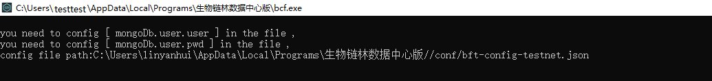

### 启动动画

启动时会出现下列加载动画界面：
    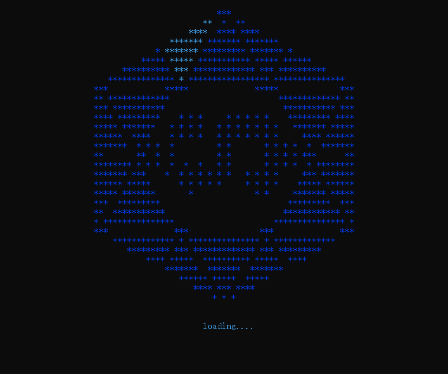
    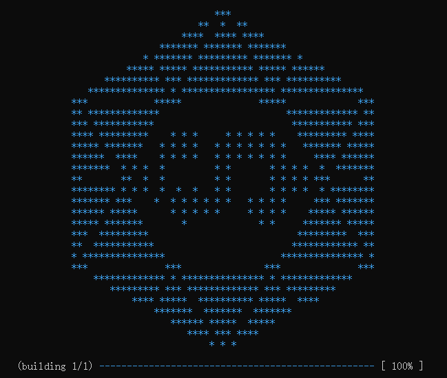

### 启动成功

当出现如下图所示的界面，则代表 BCF节点已启动成功：
    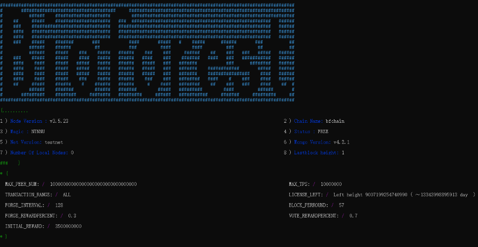

成功启动界面后，会显示当前链的信息，各参数释义说明如下：

| **参数**                  | **参数意义**                                          |
| ----------------------- | ------------------------------------------------- |
| `Node Version`          | 当前节点的版本号                                          |
| `Chain Name`            | 当前节点的链名                                           |
| `Magic`                 | 当前节点的网络标识符                                        |
| `Status`                | 当前节点状态                                            |
| `Net Version`           | 当前网络环境 `testnet`:测试网络 `mainnet`:正式网络              |
| `Mongo Version`         | 数据库的版本                                            |
| `Number Of Local Nodes` | 本地节点数量                                            |
| `Lastblock height`      | 当前节点高度                                            |
| `MAX_PEER_NUM`          | 最大连接节点数                                           |
| `MAX_TPS`               | 被允许的最大峰值                                          |
| `TRANSACTION_RANGE`     | 功能范围                                              |
| `LICENSE_LEFT`          | 授权剩余高度（当区块已到达授权高度时将不再锻造区块，需要联系bcf团队更新授权文件才可继续锻造）  |
| `FORGE_INTERVAL`        | 打块间隔，指每个区块的间隔时间                                   |
| `BLOCK_PERROUND`        | 每个轮次的区块数量                                         |
| `FORGE_REWARDPERCENT`   | 锻造区块的收益比例。例如区块总奖励为35，比例为0.3，则锻造者获得10.5的奖励         |
| `VOTE_REWARDPERCENT`    | 参与投票获得收益比例。例如区块总奖励为35，比例为0.7，则参与投票的地址可分配的总奖励为24.5 |
| `INITIAL_REWARD`        | 区块初始奖励值                                           |

## 绑定地址

当用户成功启动BCF.exe后，界面会给出如下图所示 “等待绑定地址”的提示：
    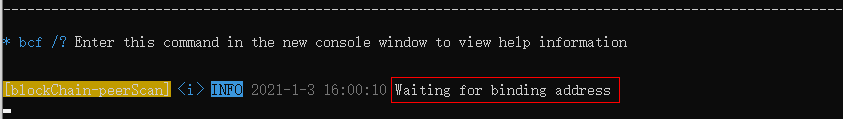

此时，用户需要设置地址私钥，以便完成地址绑定，具体操作步骤如下：

1. 打开Windows命令行窗口；

2. 获取节点密码
   
   在窗口中输入命令`bcf /ba /?`，在返回的信息中，找到`systemSecret`参数，该参数值即为节点密码，如下图所示：
   
    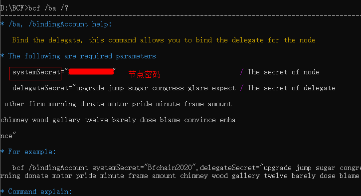

3. 设置节点私钥
   
   在窗口中输入命令`bcf /ba systemSecret=“您的节点密码”`,`delegateSecret="节点私钥"`，当BCF.exe界面给出绑定的地址信息时，说明地址绑定成功，如下图所示：
   
    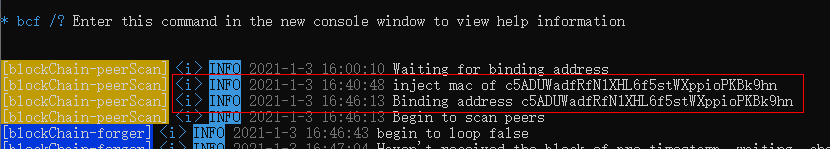

> 注1：有关`ba`接口及其参数的使用，请参见[\<设置节点地址\>](#_设置节点受托人)；

> 注2：由于在Windows控制台中对文字编辑等操作，会使得程序暂时停止，故在执行第3步命令时，若BCF.exe界面无任何反应，可按下`Enter`，BCF将会继续运行。您还可以参考[\<关于运行节点程序时，程序停止的问题\>](#_关于运行节点程序时，程序停止的问题)解决此问题。

## 节点状态

用户成功绑定地址后，BCF界面将显示出当前节点的状态信息，以下对几种常见的节点状态做说明。

### 节点锻造区块

如下图所示信息中，表示节点正在持续锻造新的区块，并打印出区块锻造过程中的相关日志信息，如区块高度、区块时间戳、包含事件数等：
    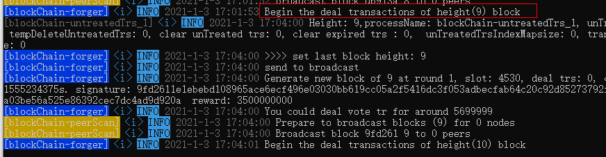

### 节点同步区块

下图为同步区块时的控制台日志信息，表示此时节点正在正常的向其它节点同步区块：
    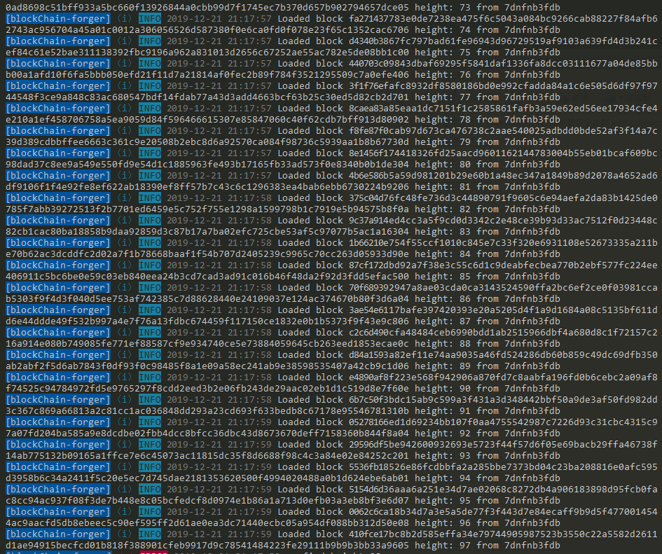

### 节点重建

如下图所示为重建数据库，一般在第一次启动，或者节点分叉且无关键检查点时触发，此时代表节点正在重构区块链数据，属于正常启动过程中的一个环节：
    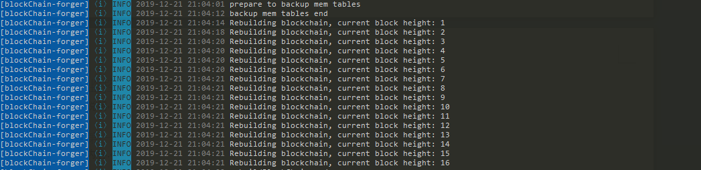
